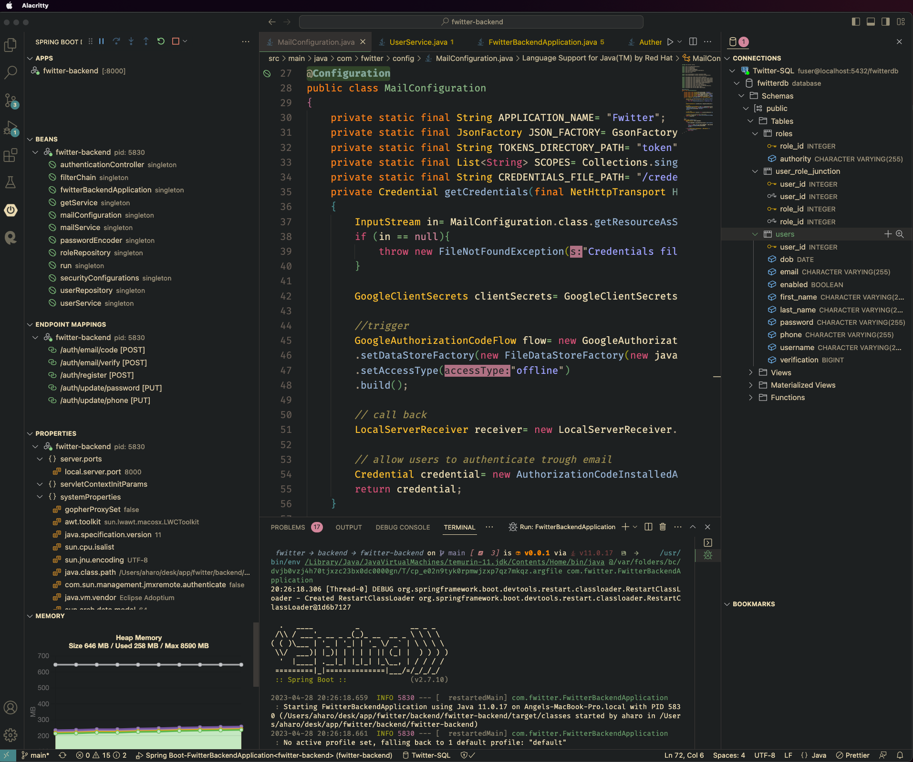

<h1 align="center"> <b> Angel J. Haro </b>


</h1>

<!-- START  -->
<div align="center">
<a href="https://aharoj.io"></a>&nbsp;
<a href="https://discord.gg/HDDQ6pUMHt"></a>&nbsp;
<a href="https://twitter.com/aharoJ"></a>&nbsp;
<a href="https://www.linkedin.com/in/aharoJ/"></a>&nbsp;
<a href="https://leetcode.com/aharoJ/"></a>&nbsp;
<br/>
</div>  
<!-- END -->

<h1 align="center"> <a href=https://aharoj.io> Visit Portfolio </a> </h1>

### Frontend Snippet


### Backend Snippet



---

# How To Run

1. Run Database
2. Run Backend
3. Run Frontend

```sh
git clone https://github.com/aharoJ/Twitter.git
```

```sh
cd Twitter
```

---

## Database

### make sure you `create` the PostgreSQL database

> src/resources/application.properties
> remove CAPS variable names and add your credentials

```sh
spring.datasource.url=jdbc:mysql://localhost:3306/DATABASE_NAME
spring.datasource.username=YOUR_USERNAME
spring.datasource.password=YOUR_PASSWORD
```

---

## Backend

> cd into the backend and do

```sh
./mvwn clean install
```

RUN SPRING

```sh
 ./mvnw clean spring-boot:run
```

---

> cd into the frontend and do

## Frontend

```sh
npm install --force
npm run dev
```

### RUN the frontend

```sh
 npm run dev
```
